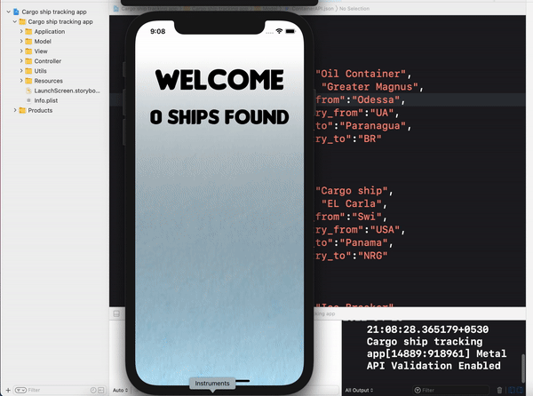

# CargoShip3D

Utilizes in-built JSON to provide data.
SceneKit to implement Cargo ship model. (Some resources for free 3d models:- free3d.com, cadnav.com, turbosquid.com)
Custom ViewController transitioning methods for circular effect.
CADisplayLink to provide counting animation on main screen.

